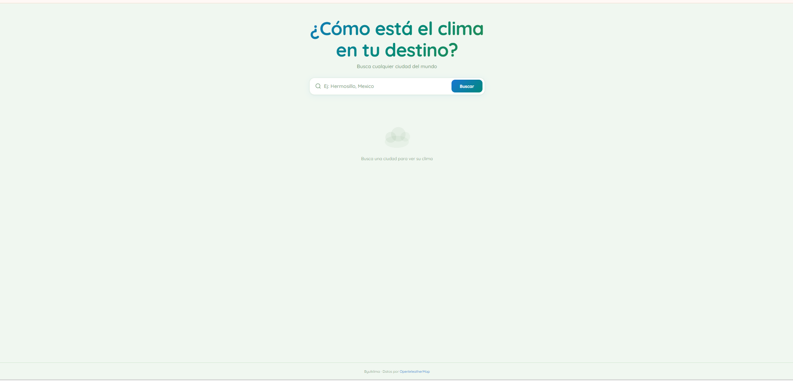
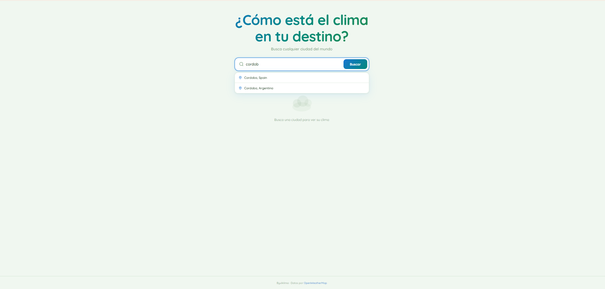
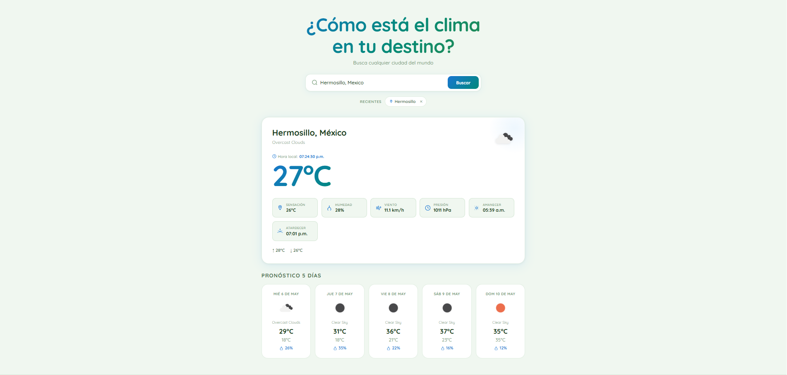
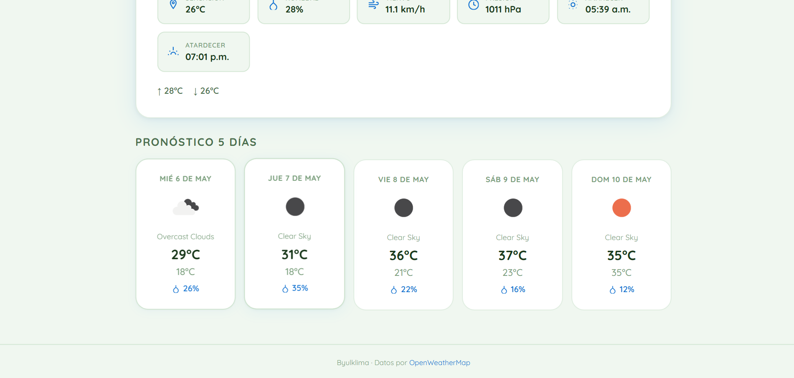
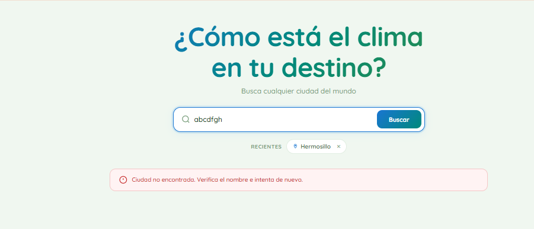

# 🌤️ Byulklima — Widget del Clima

Aplicación web de clima desarrollada con **Angular 17+**. Permite buscar cualquier ciudad del mundo y visualizar el clima actual, pronóstico extendido a 5 días y hora local en tiempo real.

Página públicada: https://marianamador.github.io/byulklima/

---

## 📸 Capturas de Pantalla

### Pantalla de inicio


### Autocompletado en el buscador


### Tarjeta de clima actual con hora local


### Pronóstico extendido 5 días


### Mensaje de error



---

## 📋 Descripción del Proyecto

Byulklima consume la API real de **OpenWeatherMap** para mostrar datos meteorológicos actualizados. Cuenta con modo claro, diseño completamente responsivo y una paleta de colores verde/azul.

---

## 🚀 Funcionalidades

- **Búsqueda** de cualquier ciudad del mundo
- **Autocompletado** con más de 80 ciudades populares y normalización de acentos
- **Tarjeta de clima actual** con:
  - Temperatura en °C
  - Sensación térmica
  - Humedad
  - Viento en km/h
  - Presión atmosférica
  - Hora de amanecer y atardecer
  - **Hora local en tiempo real** (se actualiza cada segundo)
  - Ícono dinámico del estado del clima
- **Pronóstico de 5 días** en grid con temperatura máx/mín, descripción y humedad
- **Caché de últimas 5 búsquedas** persistente en `localStorage`
- **Mensajes de error** claros: ciudad no encontrada, sin conexión, API key inválida
- **Modo claro/oscuro** con persistencia en `localStorage`
- **Diseño responsivo** con breakpoints para móvil, tablet y escritorio

---

## 🛠️ Tecnologías

- Angular 17+ (Standalone Components)
- TypeScript
- SCSS
- OpenWeatherMap API
- RxJS (`Observable`, `forkJoin`, `catchError`, `tap`, `debounceTime`)
- Google Fonts — Quicksand

---


## ⚙️ Instalación y Uso

```bash
# 1. Instalar dependencias
npm install

# 2. Correr en desarrollo
ng serve

# 3. Abrir en el navegador
http://localhost:4200
```

---

## 🔑 API Key

La API key de OpenWeatherMap está configurada en `src/environments/environment.ts`:
